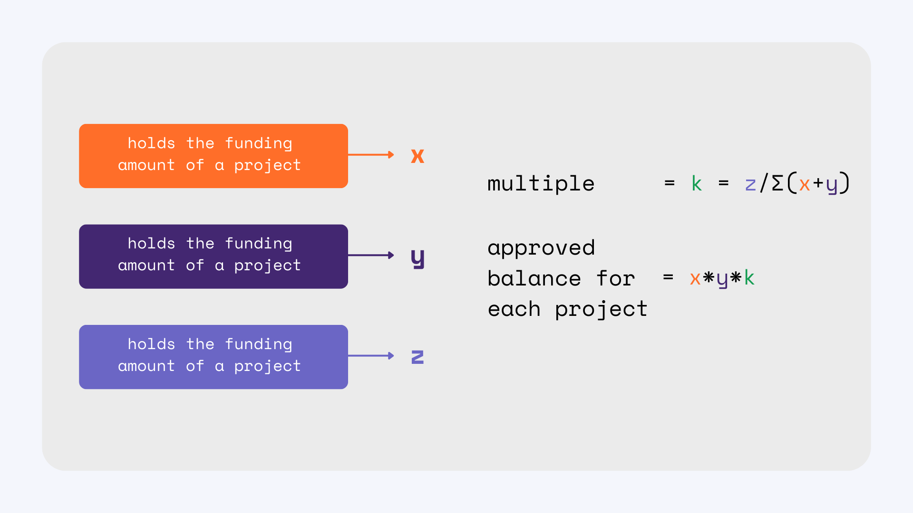
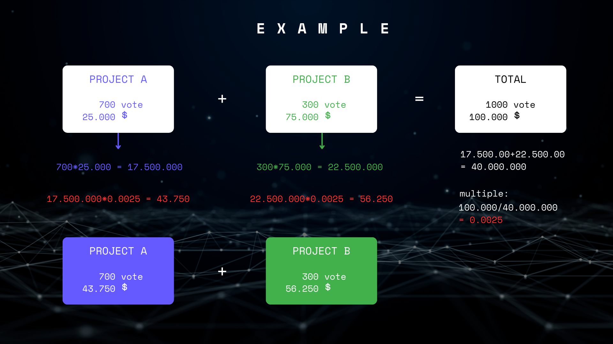

## Inspiration

The main purpose and philosophy of blockchain technology can be summarized as correcting existing injustices and focusing on real problems. This principle impressed us deeply and inspired us to adopt this mission in our project. One of the biggest challenges, both as a student and blockchain club, was finding funds for our cool ideas and projects. We took action to address this issue and also wanted to correct a deficiency in existing funding systems.

This project was not just a step forward, but an effort to turn a vision into reality. Project reflects the vision of realizing the potential of blockchain technology and making the financing of future projects more equitable. Based on the values we believe in, we prioritized fairness and participation in this project. Our goal is to create a change in the world of blockchain and provide solutions to real problems.

## What it Does & How it Work?

FundWave is a crowdfunding platform that allows teams of at least 5 members to join the system using multi-signature wallets. This eliminates the need for appointing a specific administrator within the community and creates a decentralized autonomous organization (DAO) structure. Furthermore, the multi-signature wallets must meet the following criterias:

- The multi-signature wallet should have a minimum of 5 members, and these members should be accessible through the getOwners() function.
- There should not be a specific owner; instead, all users in the multi-signature wallet should be considered owners.
- The constructor of the wallet should include the contract address of our DAO, and it should be accessible through the getDaoContractAddress() function.
- There should be an isOwner() function to check if a user is an owner.
- The wallet must have fallback and receive functions to receive funds.
- You can directly obtain the contract from our <a href="https://github.com/bublockchaintech/chainlink-hackathon/blob/master/hardhat/contracts/MultiSignature.sol">GitHub repository</a> and customize it according to your needs.
- Your contract should be verified on Mumbai PolygonScan so that we can review your code and approve your requests.
- All members must undergo KYC (Know Your Customer) verification. This step will be added later.

Teams that meet these criteria can integrate with our system and add their projects for funding.

The FundWave platform consists of 4 stages:

1. Initialization Stage: This stage serves as a precursor to the project creation phase.
2. Project Creation Stage: Community members create their projects and share the relevant information on the platform. This stage has a specific duration and transitions to the funding stage upon completion.
3. Funding Stage: Users start providing funds to the projects they like within the system. This stage also has a predefined duration and transitions the projects to the execution stage. The total amount of funds raised for each project and the number of participants contributing to the funding are displayed.
4. Execution Stage: In this stage, information such as the total amount of funds raised, the number of participants, and approved balances for each project is available.

Chainlink Automation technology enables the transition between stages without the need for a centralized structure. As a result, automation processes are carried out in a decentralized manner. Chainlink eliminates the influence of real individuals in this automated process that operates at specific time intervals.

At the end of these stages, communities can withdraw their approved funds and implement their projects. Additionally, users can view previous projects on FundWave and access detailed information on community pages.

The FundWave platform aims to provide a fair and participant-centric approach to crowdfunding. While traditional systems often prioritize financial contributions, we believe that the involvement of each individual is valuable. Therefore, we have developed a formula that balances the amount of funds and the number of participants, ensuring a more equitable distribution. You can review the details of our formula and how it works in the image below.

## How We Built It?

Initially, we had a **clear vision** of what we wanted to accomplish in the project. Therefore, we started by creating flowcharts to establish the logic of the project. Then, we planned the tasks of our team members who were responsible for design and smart contract development.

For the frontend, we began developing the project using Next.js. However, due to some difficulties with certain packages, we decided to switch to React.js. During this transition, we integrated the smart contracts and implemented the design in the frontend code.

We utilized tools like Figma and Canva for **design**.

Technologies such as Solidity, OpenZeppelin, Hardhat and Chainlink Automation for **smart contracts**.

- We used solidity for develop our Smart Contracts.
- OpenZeppelin for SafeMath library.
- Hardhat for deploy and configuration.
- Chainlink for setting stages with automation.

Technologies such as React.js, Bootstrap, ethers, and web3modal for the **frontend development**.

## Challenges We Ran Into?

During the project development process, we encountered various challenges. These challenges were related to both _team dynamics and technical_ issues.

**Regarding team dynamics**, we initially started with a team of five members for the project development. However, due to some of our team members not being able to provide sufficient support, we had to continue with a team of three. This situation sometimes led to discussions about how to collaborate within the team and how to distribute tasks.

**Regarding technically**, at the beginning of the project, we were developing using technologies like _HTML, CSS, and Bootstrap_. Later on, we were reconfiguring the code to be based on _Next.js_. However, during this transition, we **faced issues** with the _Bootstrap package in Next.js_. Some of the Bootstrap code was causing problems in Next.js, which is a server-side rendering (SSR) framework. Therefore, we had to take a step back and switch back to _React.js_ in the project.

During this process, we also faced some difficulties in receiving sufficient help from some team members regarding frontend issues. However, in the end, we **managed to resolve** these problems.

## Accomplishments That We're Proud Of

As a team, we had participated in a few events and created some projects before, but this time, we **successfully completed** a project that we worked on for a **longer period** and we are proud of. We achieved a project that fully _satisfies_ us and brings us a sense of pride.

Additionally, we take pride in our goal of _providing users with a **sustainable system** by identifying the features_ we plan to add to our project in the future.

## What We Learned?

We had previously participated as a team in three competitions, some of which were online and some were in-person. In short-term competitions held in person, we were successful in maintaining team communication. However, communication became _more challenging_ during this online hackathon process due to concurrent exams and some team members' work-related responsibilities. Throughout this process, we gained a **better understanding of what it means to be a team**.

We learned _how to communicate_ with each team member and _how to approach_ them better. By recognizing each other's strengths and weaknesses, we grasped the _importance of collaboration_.

Therefore, as a technically we weren't use Chainlink Automation before. So we learned how can we integrate Chainlink Automation to our projects.

## What's Next for Fund Wave?

1. Firstly, we plan to integrate **KYC (Know Your Customer)** services to ensure that users participating in multi-signature contracts have verified KYC information. This will increase _user security and create a more reliable platform_.

2. We are considering developing a mechanism that **covers gas fees** for users' _specified number of transactions_, enabling users to use the platform without concerns about transaction fees.

3. We continue our plan to create a three-stage system to transition to a more **decentralized structure** and assign **supervisory roles** to users who meet specific criteria. At the same time, we aim to ensure the sustainability of the system by providing these supervisory users with _payments from the pool funds_.

4. After the distribution of funds, we plan to establish a _more transparent system_ by **gradually allocating funds** and _obtaining reports_ on how the funds are used in projects. This way, users will have access _to reliable information_ about how the funds are utilized.

5. We are planning to transition to a **multichain structure** and enable funding with assets from different networks. This will allow users to support projects using assets from different blockchains and create a wider ecosystem.

6. By **categorizing projects and fund pools**, we aim to create competition among projects within their own categories. Similar projects within the same category will have their own fund pool, _ensuring a fairer voting process_.

7. Additionally, taking user feedback and suggestions into account, we will continuously improve the platform. We will monitor user feedback and make necessary improvements to understand their needs and provide the platform in the best possible way.

With these goals in mind, we will continue our efforts to further expand **Fund Wave** and make it a valuable blockchain application for users.
